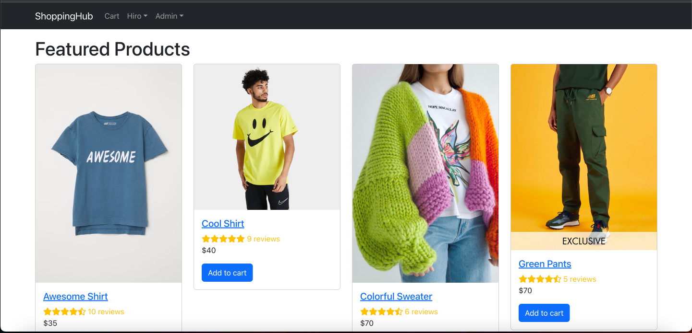
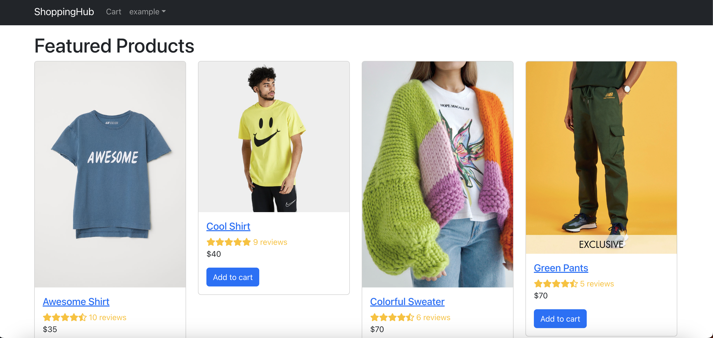

# ShoppingHub - Your Ultimate E-Commerce Destination

Welcome to ShoppingHub, the ultimate online shopping platform where you can discover, explore, and shop for a diverse range of products. From fashion and electronics to home essentials, ShoppingHub has got you covered.

## Table of Contents

- [Project Overview](#project-overview)
- [Features](#features)
- [Technologies Used](#technologies-used)
- [Credits](#credits)
- [Deployment](#deployment)

## Project Overview

ShoppingHub is a comprehensive e-commerce website that offers a user-friendly experience for shoppers. With an extensive catalog, secure payment processing, and user profiles, ShoppingHub aims to be your go-to destination for online shopping.

## Features

- User registration and authentication.
- Product details pages with images, descriptions, and reviews.
- Shopping cart functionality with quantity adjustment.
- Secure checkout process and payment handling.
- User profile management and order history.
- Admin dashboard for managing products and orders.
- Responsive design for mobile and desktop devices.

## Technologies Used

This project utilizes a variety of technologies to deliver a dynamic and feature-rich e-commerce experience:

- **Frontend**:
  - React: JavaScript library for building user interfaces.
  - React Router: Handling navigation and routing within the app.
  - React Bootstrap: UI components and styling for a responsive design.
  - Axios: Making HTTP requests to the backend API.
  - PayPal React Integration: Secure payment processing using PayPal.
  - React Helmet Async: Managing the document head for SEO optimization.

- **Backend**:
  - Node.js: JavaScript runtime for building server-side applications.
  - Express.js: Web application framework for Node.js.
  - MongoDB: NoSQL database for storing product, user, and order data.
  - Mongoose: Object Data Modeling (ODM) library for MongoDB.
  - JWT (JSON Web Tokens): Securely transmitting authentication data.
  - Bcrypt: Hashing and salting passwords for secure storage.

- **Deployment**:
  - Heroku: Cloud platform for deploying the backend server.
  - MongoDB Atlas: Cloud database service for hosting the MongoDB database.

This project brings together these technologies to create a seamless and engaging online shopping experience.


## Getting Started

### Heroku Deployment

Access the application in Heroku: [ShoppingHub](https://peaceful-coast-10837-e5ffde853d9b.herokuapp.com/)

### Local Installation

To run the project locally, follow these steps:

1. Clone the repository:
   ```
   git clone https://github.com/your-username/shoppinghub.git
   ```
2. Install dependencies:
   ```
   cd shoppinghub
   cd server
   npm install
   cd ../client
   npm install
   ```
3. Create a .env file in the server directory and set your environment variables.

4. Srart the server and client
    ```
    cd server
    npm start
    cd ../client
    npm start
    ```

## Credits

- [@AngadBatth](https://github.com/AngadBatth) 
- [@Hiroro1989](https://github.com/Hiroro1989)
- [@matthewzmija](https://github.com/matthewzmija)
- [@PacoCasillas](https://github.com/PacoCasillas)
- [@Saloni0412](https://github.com/Saloni0412)

## Deployment

[https://peaceful-coast-10837-e5ffde853d9b.herokuapp.com/](https://peaceful-coast-10837-e5ffde853d9b.herokuapp.com/)




   
