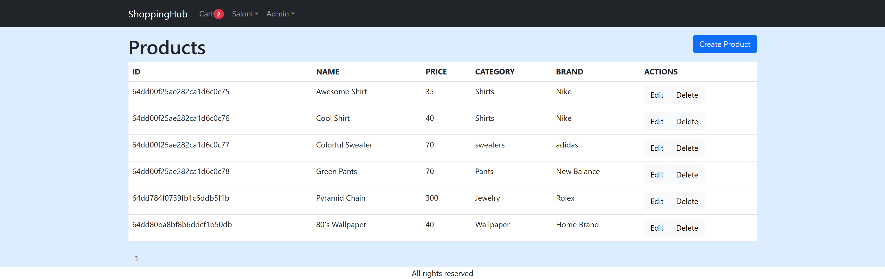

# ShoppingHub
      

"Shopping Hub" is an all-inclusive online shopping application that provides a seamless and diverse shopping experience. It offers a dynamic and interactive user interface that responds smoothly to user actions. It demonstrates the capabilities of the MERN stack combined with Mongoose, offering a feature-rich and user-friendly online shopping experience that's secure, efficient, and enjoyable for both customers and administrators.

## Table of Contents
- [Technologies Used](#technologies-used)
- [Installation](#installation)
- [Usage](#usage)
- [License](#license)
- [Questions](#questions)

## Technologies Used
ShoppingHub is built using the following technologies:
- Javascript
- MongoDB
- Express.js
- MERN stack
- NodeJS
- Heroku
Feel free to explore and leverage these technologies to extend and customize the functionality of ShoppingHub.

## Installation
To install this application you will need to download NODE JS and npm packages. Once downloaded clone this repository to your local machine, run command npm install/ npm i express which will install all express dependencies. Create a ``.env`` file with the required keys 

## Usage
Once the app is running in nodeJS,
- run ``npm run build`` and it will compile the files and will open ``http://localhost:3000/`` in any browser, and you will have ShoppingHub.
- You can click on the product to see details
- To checkout the items, you will have to ``sign up/login``.
- Once you login you can add items to cart using ``add to cart`` button
- You can also remove item from the cart using ``bin icon`` and it will be removed from the cart.
- Please feel free to use the app - <a href="https://peaceful-coast-10837-e5ffde853d9b.herokuapp.com/" target="_blank">Link to the app</a>
 

The screenshot for the project is mentioned below.

 

Product detail page

 

cart page

 

admin view

 

signin page

## Credits
- <a href="https://github.com/Hiroro1989" target="_blank">Hiroro</a>
- <a href="https://github.com/Saloni0412" target="_blank">Saloni Patel</a>
- <a href="https://github.com/PacoCasillas" target="_blank">Francisco Olivares Casillas</a>
- <a href="https://github.com/matthewzmija" target="_blank">Matthew</a>
- <a href="https://github.com/AngadBatth" target="_blank">Angad Bath</a>

## License
MIT license

## Questions
If you have any questions about the repo, please contact us through github.
